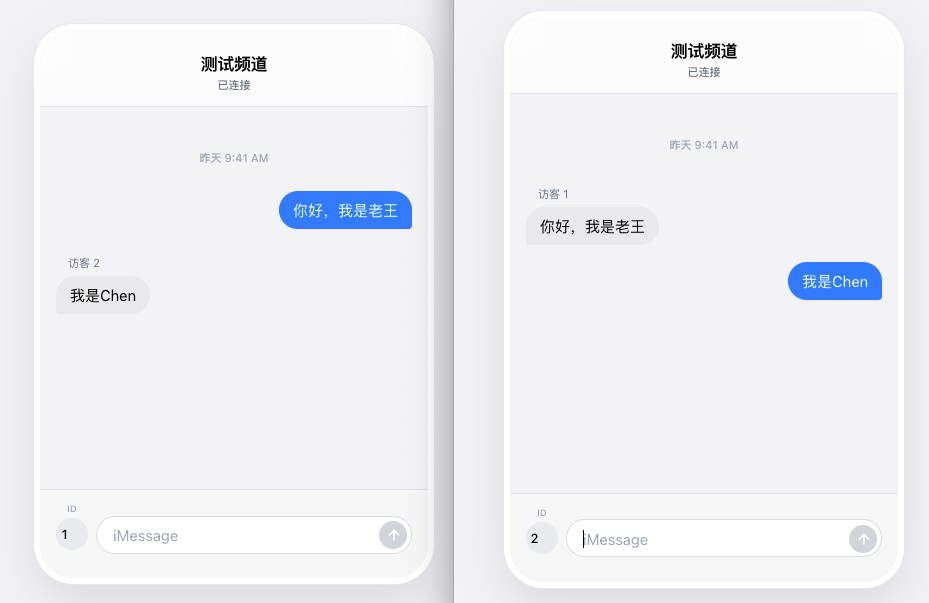
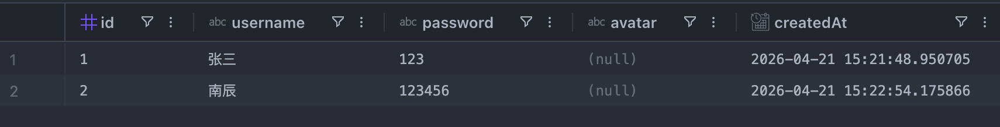
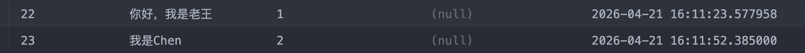
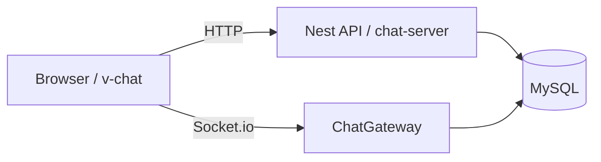
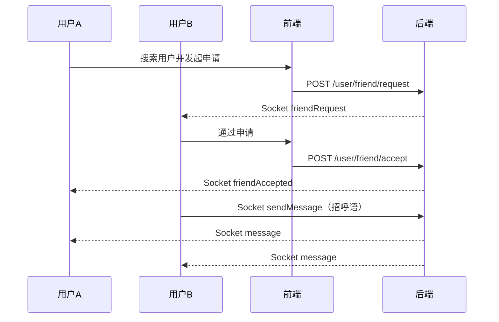

# 实时聊天系统（Vue 3 + Nest.js + Socket.io）

一个可直接运行的前后端分离实时聊天项目，覆盖从注册登录到好友关系、实时私聊、会话未读与已读闭环的完整链路。

## 功能亮点
- 用户系统：注册、登录、个人信息获取
- 好友系统：搜索、发申请、通过/拒绝、待处理列表
- 实时通信：Socket.io 私聊消息、好友通知
- 会话系统：最近会话、会话未读统计
- 已读机制：进入聊天页后标记已读并同步红点
- 标准响应：后端全局拦截器统一 `code/message/data`

---

## 在线演示截图

> 项目内已有素材，可直接在 GitHub 显示。

| 首页/消息 | 注册/登录 | 聊天消息 |
|---|---|---|
|  |  |  |

---

## 技术栈

### 前端（`v-chat`）
- Vue 3 + Vite + TypeScript
- Vant + Pinia
- axios + socket.io-client

### 后端（`chat-server`）
- Nest.js + TypeORM
- MySQL
- Socket.io
- JWT

---

## 项目结构

```text
.
├── chat-server/               # 后端 Nest 项目
├── v-chat/                    # 前端 Vue 项目
├── chat-test.html             # Socket 快速测试页面
├── 后端文档.md                 # 后端开发文档（阶段化）
├── 前端文档.md                 # 前端开发文档（阶段化）
├── 部署文档.md                 # 部署文档（Render/Vercel/MySQL）
└── 多账号测试指南.md            # 多账号联调手册
```

---

## 架构图



---

## 核心流程图（加好友到聊天）



---

## 快速开始（本地）

## 1) 准备数据库
确保本地 MySQL 已启动，并创建数据库：

```sql
CREATE DATABASE chat_db;
```

## 2) 启动后端

```bash
cd chat-server
pnpm install
```

创建 `chat-server/.env`：

```bash
DB_HOST=localhost
DB_PORT=3306
DB_USERNAME=username
DB_PASSWORD=password
DB_DATABASE=chat_db
JWT_SECRET=your_jwt_secret_key
```

启动：

```bash
pnpm run start:dev
```

后端地址：`http://localhost:3000`

## 3) 启动前端

```bash
cd v-chat
pnpm install
```

创建 `v-chat/.env.development`：

```bash
VITE_API_BASE_URL=http://localhost:3000
```

启动：

```bash
pnpm dev
```

前端地址：`http://localhost:5173`

---

## API 一览

### 认证与用户
| 方法 | 路径 | 说明 |
|---|---|---|
| POST | `/user/register` | 注册 |
| POST | `/auth/login` | 登录 |
| GET | `/user/info?id=xxx` | 获取用户信息 |
| GET | `/user/search?username=xxx` | 搜索用户 |

### 好友系统
| 方法 | 路径 | 说明 |
|---|---|---|
| POST | `/user/friend/request` | 发起好友申请 |
| POST | `/user/friend/accept` | 同意申请 |
| POST | `/user/friend/reject` | 拒绝申请 |
| GET | `/user/friend/pending?userId=xxx` | 待处理申请 |
| GET | `/user/friend/list?userId=xxx` | 好友列表 |

### 聊天系统
| 方法 | 路径 | 说明 |
|---|---|---|
| GET | `/chat/history?user1Id=xxx&user2Id=xxx` | 历史消息 |
| GET | `/chat/sessions?userId=xxx` | 最近会话 |
| POST | `/chat/read` | 标记已读 |

---

## Socket 事件

### 前端发送
- `sendMessage`

### 前端监听
- `message`
- `friendRequest`
- `friendAccepted`
- `friendRejected`
- `error`

---

## 文档导航

- [后端文档.md](./后端文档.md)
- [前端文档.md](./前端文档.md)
- [Vue开发接入指南.md](./Vue开发接入指南.md)
- [多账号测试指南.md](./多账号测试指南.md)
- [部署文档.md](./部署文档.md)

---

## 部署

部署方式与环境变量模板请查看：
- [部署文档.md](./部署文档.md)

---

## 常见问题

### 1. 前端请求打到 localhost
检查 `v-chat/.env.development` 或线上 `VITE_API_BASE_URL`。

### 2. 注册/登录 500
检查 MySQL 连接信息与数据库是否存在。

### 3. HTTP 通但消息不实时
检查 Socket 地址、CORS 配置、Gateway 是否正常启动。

---

## License

本项目用于学习与演示，可按需二次开发。
