# 别再把聊天前端当普通 CRUD 了！Vue 3 + Socket.io 实时聊天项目完整开发文档

接上篇文档，这篇将展示前端界面及功能
先看目标：
- 完成注册、登录、通讯录、好友申请、私聊会话、未读数徽章。
- 与后端 `chat-server` 接口与事件完全对齐。
注册及登录展示：
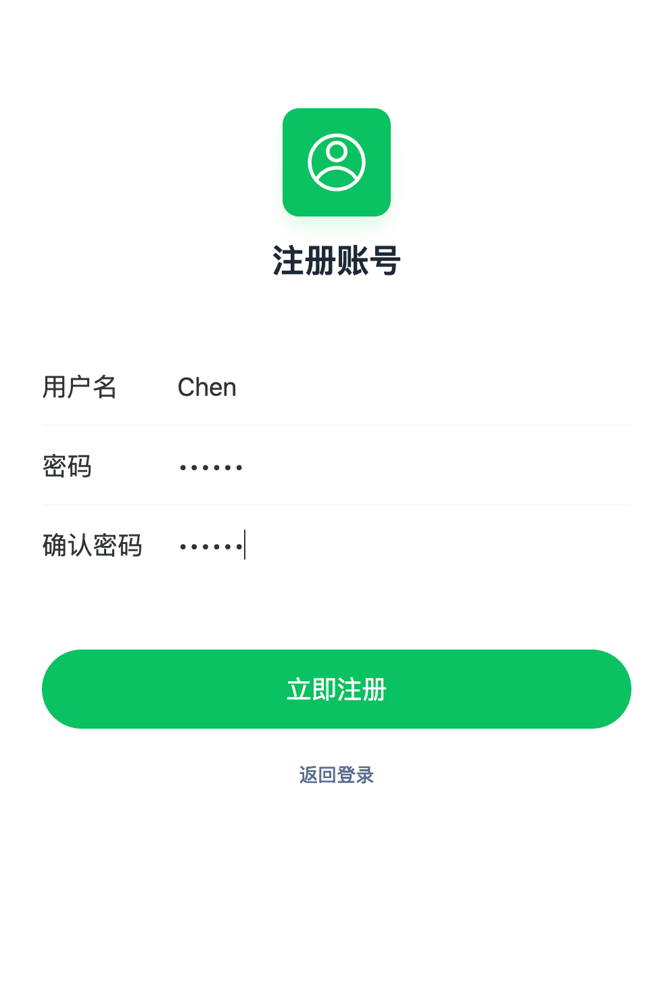
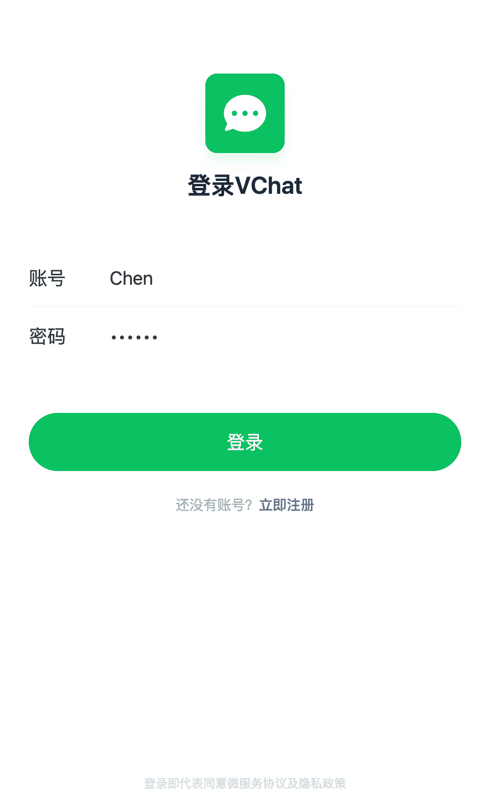

添加好友：
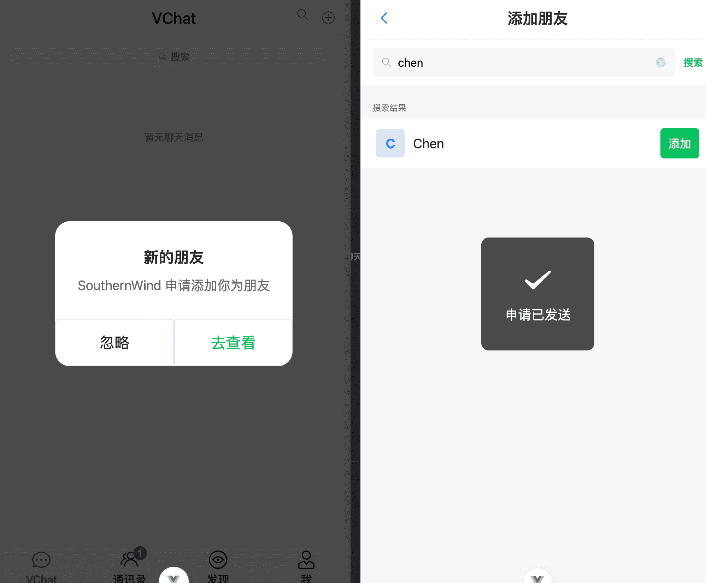
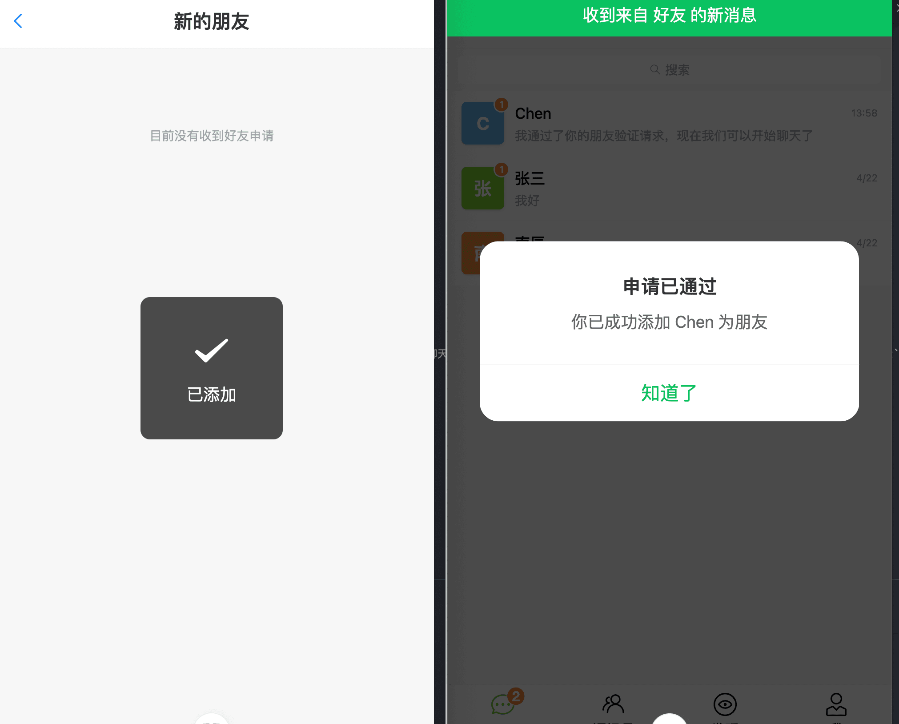
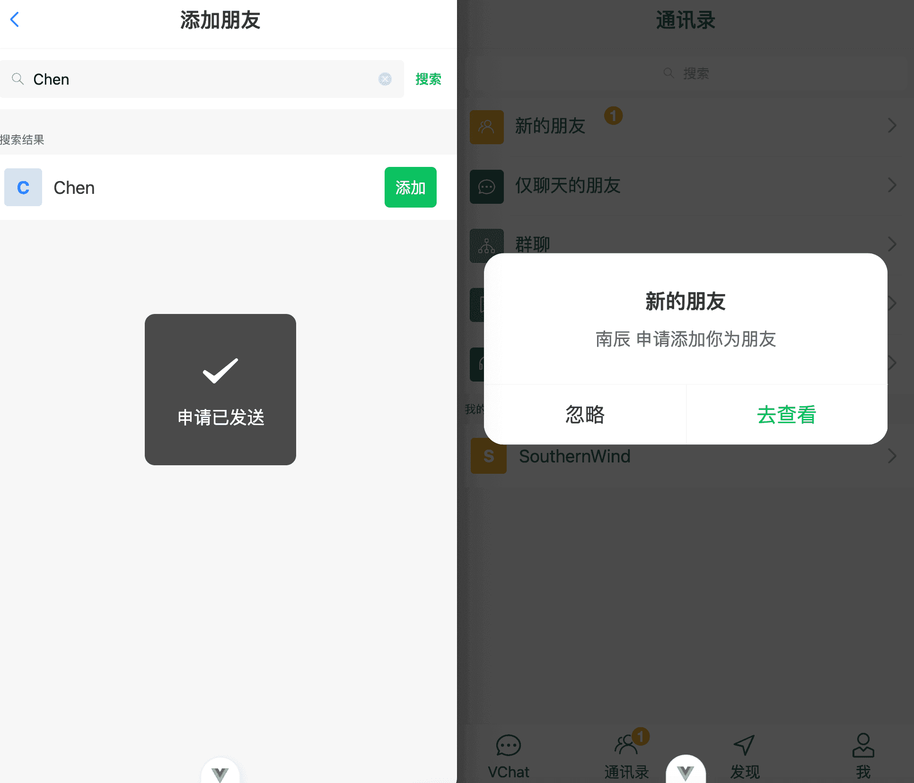
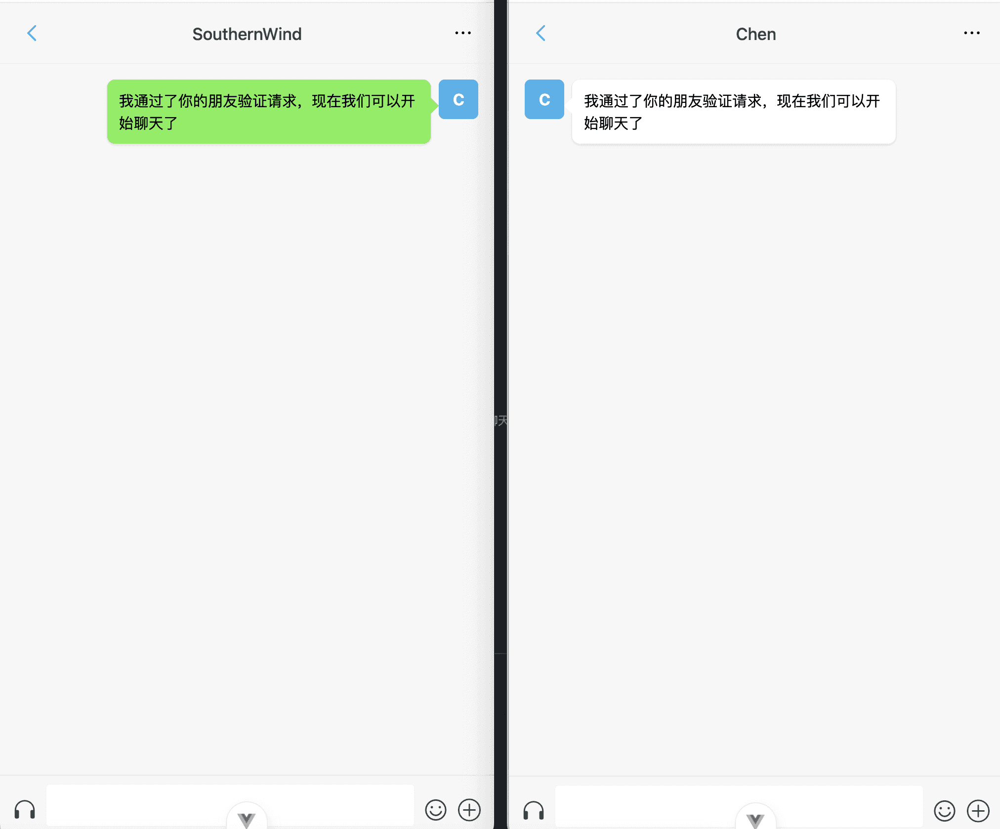
效果展示：
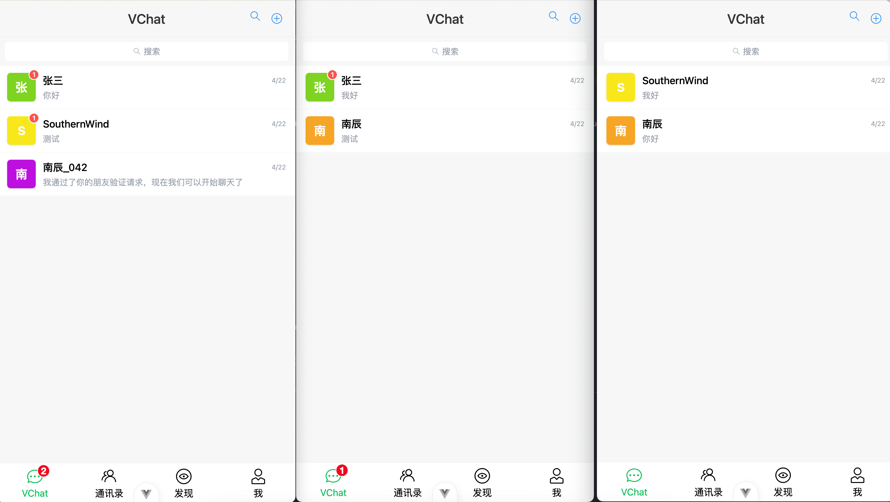
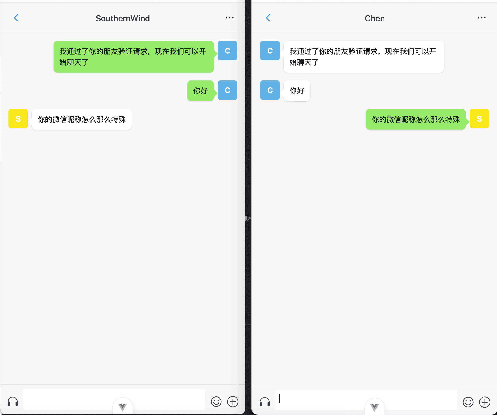
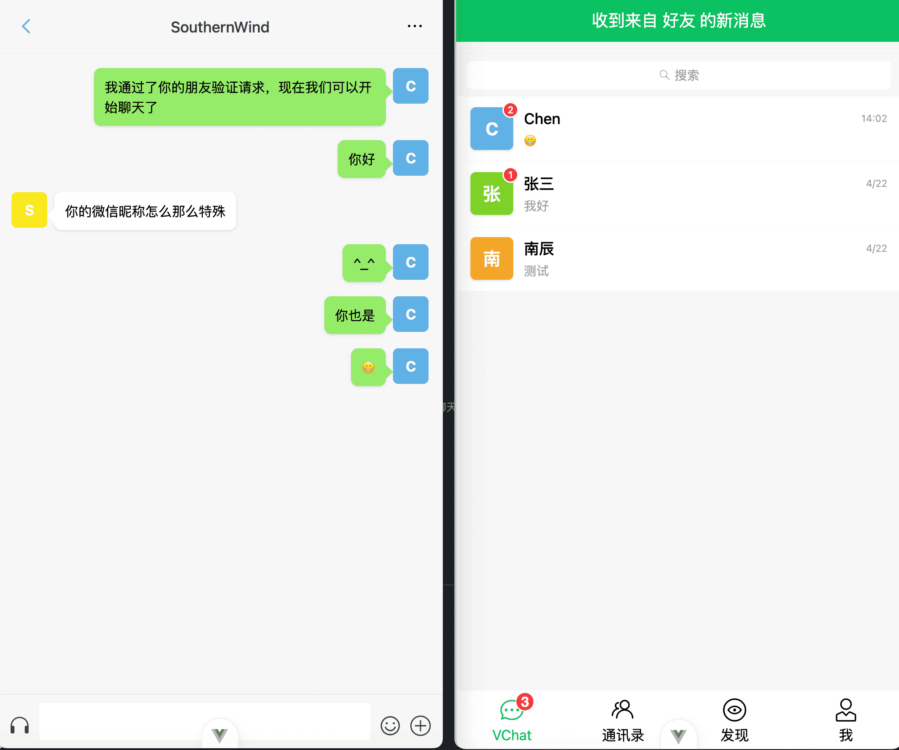
角色展示
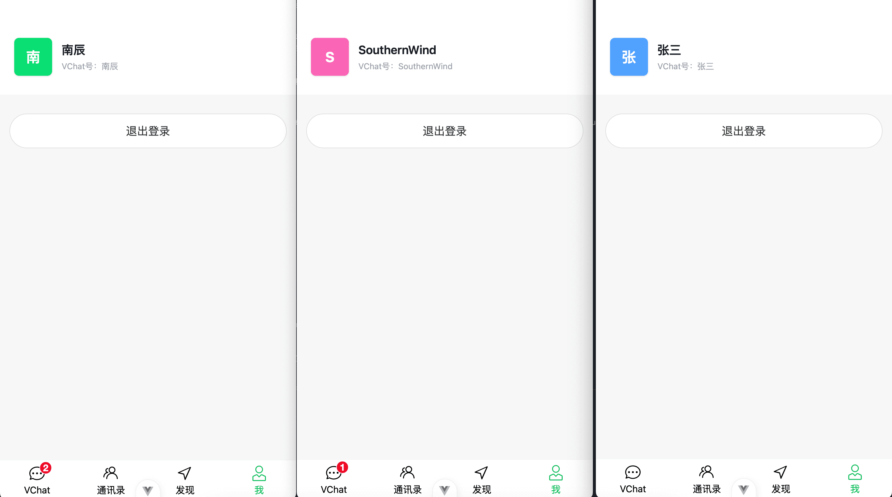

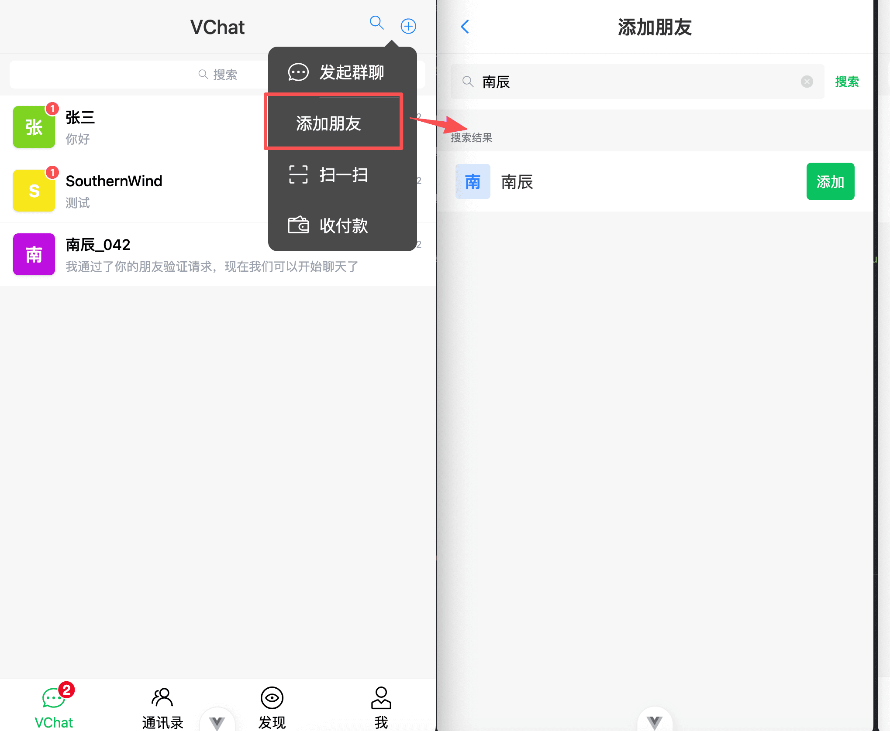
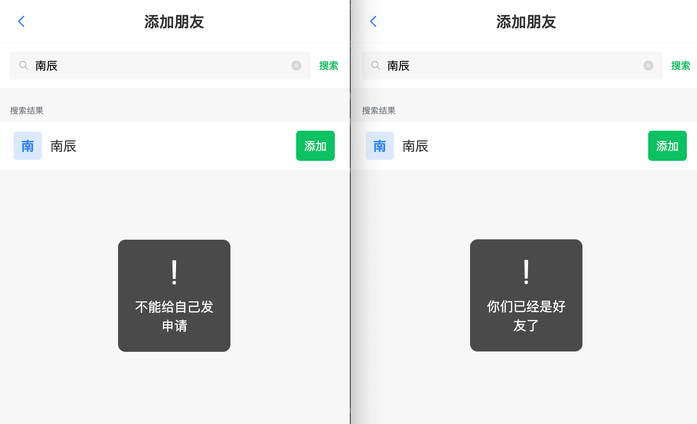
---

## 前言
本文档旨在提供和后端文档同等粒度的前端开发步骤。我们将从环境搭建开始，逐步实现认证、会话、通讯录与实时聊天。前端采用 `Vue 3 + Vite + TypeScript + Vant + Pinia + Socket.io-client`。

前端项目目录：`v-chat`
后端项目目录：`chat-server`

---

## 第一阶段：环境搭建与基础配置

### 1.1 安装并启动项目
```bash
cd v-chat
pnpm install
pnpm dev
```

默认访问：`http://localhost:5173`

### 1.2 配置后端地址
在 `v-chat` 下新建 `.env.development`：

```bash
VITE_API_BASE_URL=http://localhost:3000
```

> 说明：HTTP 请求与 Socket 连接都会读取该变量。

### 1.3 配置入口文件
**文件路径**：`src/main.ts`

```ts
import 'vant/lib/index.css'
import './assets/main.css'

import { createApp } from 'vue'
import { createPinia } from 'pinia'

import App from './App.vue'
import router from './router'

const app = createApp(App)
app.use(createPinia())
app.use(router)
app.mount('#app')
```

---

## 第二阶段：请求层与 Socket 层封装

### 2.1 封装 Axios 请求实例
**文件路径**：`src/utils/request.ts`

```ts
import axios from 'axios'
import type { AxiosInstance, AxiosRequestConfig, AxiosResponse } from 'axios'
import { showFailToast } from 'vant'

const service: AxiosInstance = axios.create({
  baseURL: import.meta.env.VITE_API_BASE_URL || 'http://localhost:3000',
  timeout: 10000,
  headers: {
    'Content-Type': 'application/json'
  }
})

service.interceptors.response.use(
  (response: AxiosResponse) => {
    const { code, message, data } = response.data
    if (code && code >= 400) {
      showFailToast(message || '业务逻辑错误')
      return Promise.reject(new Error(message || 'Error'))
    }
    return data
  },
  (error) => {
    const message = error.response?.data?.message || error.message || '网络请求错误'
    showFailToast(message)
    return Promise.reject(error)
  }
)

const request = <T = any>(config: AxiosRequestConfig): Promise<T> => {
  return service.request(config)
}

export default request
```

### 2.2 封装 Socket 单例
**文件路径**：`src/utils/socket.ts`

```ts
import { io, Socket } from 'socket.io-client'
import { ref } from 'vue'

const socket = ref<Socket | null>(null)
let currentUserId: number | null = null
const eventListeners = new Map<string, Set<(data: any) => void>>()

export function useSocket() {
  const connect = (userId: number) => {
    if (socket.value?.connected && currentUserId === userId) return

    if (socket.value) {
      socket.value.disconnect()
    }

    currentUserId = userId
    const apiBase = import.meta.env.VITE_API_BASE_URL || 'http://localhost:3000'
    const newSocket = io(apiBase, {
      query: { userId }
    })

    eventListeners.forEach((callbacks, event) => {
      callbacks.forEach((callback) => {
        newSocket.on(event, callback)
      })
    })

    socket.value = newSocket
  }

  const emit = (event: string, data: any) => {
    socket.value?.emit(event, data)
  }

  const on = (event: string, callback: (data: any) => void) => {
    if (!eventListeners.has(event)) {
      eventListeners.set(event, new Set())
    }
    const callbacks = eventListeners.get(event)!
    if (!callbacks.has(callback)) {
      callbacks.add(callback)
      socket.value?.on(event, callback)
    }
  }

  const off = (event: string, callback: (data: any) => void) => {
    const callbacks = eventListeners.get(event)
    if (callbacks) {
      callbacks.delete(callback)
      socket.value?.off(event, callback)
    }
  }

  return { socket, connect, emit, on, off }
}
```

---

## 第三阶段：状态管理与路由鉴权

### 3.1 配置用户全局状态
**文件路径**：`src/stores/user.ts`

```ts
import { defineStore } from 'pinia'
import { ref, computed } from 'vue'

export const useUserStore = defineStore('user', () => {
  const userInfo = ref<{ id: number; username: string } | null>(null)
  const token = ref(localStorage.getItem('token') || '')
  const pendingFriendCount = ref(0)
  const sessions = ref<any[]>([])

  const totalUnreadCount = computed(() => {
    return sessions.value.reduce((sum, s) => sum + (s.unreadCount || 0), 0)
  })

  const isLoggedIn = computed(() => !!userInfo.value?.id)

  function setUser(user: { id: number; username: string }) {
    userInfo.value = user
    localStorage.setItem('currentUser', JSON.stringify(user))
  }

  function setToken(val: string) {
    token.value = val
    localStorage.setItem('token', val)
  }

  function initFromStorage() {
    const saved = localStorage.getItem('currentUser')
    if (saved) userInfo.value = JSON.parse(saved)
  }

  function logout() {
    userInfo.value = null
    token.value = ''
    pendingFriendCount.value = 0
    localStorage.removeItem('currentUser')
    localStorage.removeItem('token')
  }

  return {
    userInfo, token, pendingFriendCount, sessions, totalUnreadCount,
    isLoggedIn, setUser, setToken, initFromStorage, logout
  }
})
```

### 3.2 配置路由与守卫
**文件路径**：`src/router/index.ts`

```ts
import { createRouter, createWebHistory } from 'vue-router'
import { useUserStore } from '@/stores/user'

const router = createRouter({
  history: createWebHistory(import.meta.env.BASE_URL),
  routes: [
    { path: '/', name: 'index', component: () => import('@/views/IndexView.vue'), meta: { requiresAuth: true } },
    { path: '/auth/login', name: 'login', component: () => import('@/views/auth/LoginView.vue') },
    { path: '/auth/register', name: 'register', component: () => import('@/views/auth/RegisterView.vue') },
    { path: '/contact', name: 'contact', component: () => import('@/views/contact/ContactView.vue'), meta: { requiresAuth: true } },
    { path: '/contact/search', name: 'search', component: () => import('@/views/contact/SearchView.vue'), meta: { requiresAuth: true } },
    { path: '/contact/pending', name: 'pending', component: () => import('@/views/contact/PendingRequestsView.vue'), meta: { requiresAuth: true } },
    { path: '/chat/:id', name: 'chat', component: () => import('@/views/chat/ChatView.vue'), meta: { requiresAuth: true } },
    { path: '/me', name: 'me', component: () => import('@/views/me/MeView.vue'), meta: { requiresAuth: true } },
  ]
})

router.beforeEach((to) => {
  const userStore = useUserStore()
  userStore.initFromStorage()

  if (to.meta.requiresAuth && !userStore.isLoggedIn) {
    return { name: 'login' }
  }

  if (userStore.isLoggedIn && (to.name === 'login' || to.name === 'register')) {
    return { name: 'index' }
  }
})

export default router
```

---

## 第四阶段：接口模块封装

### 4.1 用户接口
**文件路径**：`src/api/user.ts`

```ts
import request from '@/utils/request'

export const registerApi = (data: any) => request({ url: '/user/register', method: 'post', data })
export const loginApi = (data: any) => request({ url: '/auth/login', method: 'post', data })
export const getUserInfoApi = (id: number) => request({ url: '/user/info', method: 'get', params: { id } })
export const searchUserApi = (username: string) => request({ url: '/user/search', method: 'get', params: { username } })
```

### 4.2 好友接口
**文件路径**：`src/api/friend.ts`

```ts
import request from '@/utils/request'

export const sendFriendRequestApi = (data: { requesterId: number; addresseeId: number }) =>
  request({ url: '/user/friend/request', method: 'post', data })

export const acceptFriendRequestApi = (data: { userId: number; requestId: number }) =>
  request({ url: '/user/friend/accept', method: 'post', data })

export const rejectFriendRequestApi = (data: { userId: number; requestId: number }) =>
  request({ url: '/user/friend/reject', method: 'post', data })

export const getFriendListApi = (userId: number) =>
  request({ url: '/user/friend/list', method: 'get', params: { userId } })

export const getPendingRequestsApi = (userId: number) =>
  request({ url: '/user/friend/pending', method: 'get', params: { userId } })
```

### 4.3 聊天接口
**文件路径**：`src/api/chat.ts`

```ts
import request from '@/utils/request'

export const getSessionsApi = (userId: number) =>
  request({ url: '/chat/sessions', method: 'get', params: { userId } })

export const getChatHistoryApi = (user1Id: number, user2Id: number) =>
  request({ url: '/chat/history', method: 'get', params: { user1Id, user2Id } })

export const markAsReadApi = (userId: number, friendId: number) =>
  request({ url: '/chat/read', method: 'post', data: { userId, friendId } })
```

---

## 第五阶段：全局监听与页面实现

### 5.1 全局监听入口（App.vue）
**文件路径**：`src/App.vue`

核心职责：
1. 恢复登录态后建立连接。
2. 监听 `friendRequest/friendAccepted/friendRejected/message`。
3. 在非当前聊天页收到消息时刷新会话并提醒。

### 5.2 登录页
**文件路径**：`src/views/auth/LoginView.vue`

核心逻辑：
```ts
const res = await loginApi({ username: username.value, password: password.value })
userStore.setUser({ id: res.user.id, username: res.user.username })
userStore.setToken(res.access_token)
connect(res.user.id)
router.replace('/')
```

### 5.3 注册页
**文件路径**：`src/views/auth/RegisterView.vue`

核心逻辑：
```ts
if (password.value !== confirmPassword.value) return
await registerApi({ username: username.value, password: password.value })
router.push('/auth/login')
```

### 5.4 首页会话页
**文件路径**：`src/views/IndexView.vue`

核心职责：
1. 展示 `/chat/sessions` 返回的会话数据。
2. 显示会话未读数。
3. TabBar 显示总未读和待处理申请红点。

### 5.5 通讯录页
**文件路径**：`src/views/contact/ContactView.vue`

核心职责：
1. 展示好友列表。
2. 进入“新的朋友”页处理申请。
3. 点击好友跳转聊天页。

### 5.6 搜索好友页
**文件路径**：`src/views/contact/SearchView.vue`

核心逻辑：
```ts
const res = await searchUserApi(keyword.value)
searchResult.value = res || []
await sendFriendRequestApi({ requesterId: userStore.user.id, addresseeId: targetId })
```

### 5.7 新的朋友页
**文件路径**：`src/views/contact/PendingRequestsView.vue`

核心逻辑：
```ts
await acceptFriendRequestApi({ userId: userStore.user.id, requestId })
emit('sendMessage', {
  senderId: userStore.user.id,
  receiverId: requesterId,
  content: '我通过了你的朋友验证请求，现在我们可以开始聊天了'
})
```

### 5.8 聊天页
**文件路径**：`src/views/chat/ChatView.vue`

核心职责：
1. 拉历史消息。
2. 发送 `sendMessage` 事件。
3. 监听 `message` 并仅渲染当前会话数据。
4. 进入页面立即 `markAsRead`。

核心代码：
```ts
await getChatHistoryApi(userStore.user.id, targetId)
emit('sendMessage', { senderId: userStore.user.id, receiverId: targetId, content })
await markAsReadApi(userStore.user.id, targetId)
userStore.fetchSessions()
```

---

## 第六阶段：联调测试步骤

1. 启动后端：
```bash
cd chat-server
pnpm install
pnpm run start:dev
```

2. 启动前端：
```bash
cd v-chat
pnpm install
pnpm dev
```

3. 准备两个账号 A/B，分别登录。
4. A 搜索 B 并发送好友申请。
5. B 在“新的朋友”点击通过。
6. 验证：
   - A 收到通过提示。
   - 会话出现首条打招呼消息。
   - 双方实时收发正常。
   - 非聊天页收消息时会话红点增加。
   - 进入聊天页后红点清零。

---

## 第七阶段：常见问题排查

### 7.1 登录后收不到消息
排查：
1. 登录成功后是否调用 `connect(userId)`。
2. `query.userId` 是否传给后端。
3. 后端网关是否记录用户连接日志。

### 7.2 红点不准
排查：
1. `/chat/sessions` 的 `unreadCount` 是否正确。
2. 收到新消息和标记已读后是否调用 `fetchSessions`。
3. 总未读是否来自 `computed`，而不是手工加减。

### 7.3 好友通过后发不出消息
排查：
1. 好友关系是否已 `accepted`。
2. `senderId/receiverId` 是否传错。
3. 是否监听后端返回的 `error` 事件。

---

## 收尾

到这里，前端文档已统一为后端文档风格：
- 阶段化结构。
- 每步有文件路径和代码。
- 包含完整联调与问题排查。

可直接按文档从 0 完成前端开发与联调。
