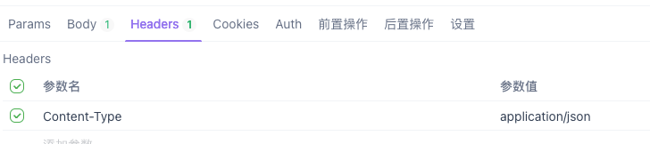
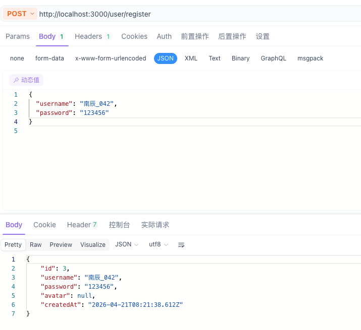
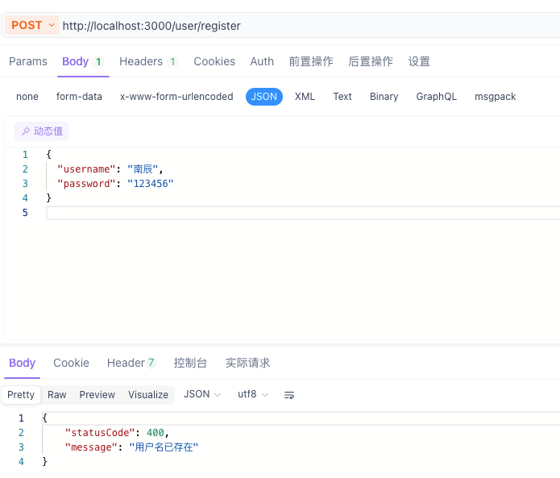
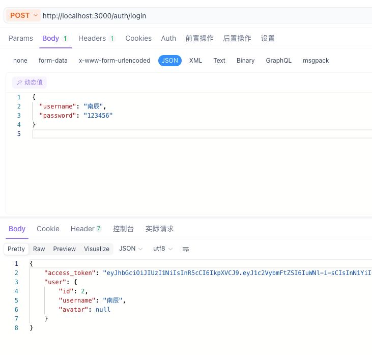

# 别再用原生的 Socket 了！Nest.js 让你的实时聊天系统开发效率翻倍

先看效果：


注册的账户


message


## 前言
本文档旨在为初学者提供 Nest.js 后端开发的详细步骤。我们将从环境搭建开始，逐步完成用户系统和实时聊天功能。后端服务采用`Nest.js`，数据库采用`Mysql`，`typeorm`作为`orm`框架，`socket.io`作为`websocket`框架。如还没有Mysql请自行安装配置，这里就不过多阐述了。

---

## 第一阶段：环境搭建与基础配置

### 1.1 初始化 Nest.js 项目
如果你还没有创建项目，请执行：
```bash
# 全局安装 Nest CLI (如果未安装)
pnpm install -g @nestjs/cli

# 创建新项目
nest new chat-server
# 选择 pnpm 作为包管理器
```

### 1.2 安装项目必需依赖
我们需要安装数据库驱动、ORM 框架、WebSocket 支持、JWT 认证等依赖包。
```bash
# 1. 数据库相关
pnpm i @nestjs/typeorm typeorm mysql2

# 2. 配置文件相关 (读取 .env)
pnpm i @nestjs/config

# 3. WebSocket 相关 (实时聊天)
pnpm i @nestjs/websockets @nestjs/platform-socket.io

# 4. 认证与安全相关 (JWT)
pnpm i @nestjs/jwt passport-jwt @types/passport-jwt
```
```bash
DB_HOST=localhost
DB_PORT=3306
DB_USERNAME=username
DB_PASSWORD=password
DB_DATABASE=chat_db
JWT_SECRET=your_jwt_secret_key
```
> **注意**：
> 1. 请确保你的本地 MySQL 服务已启动。
> 2. **必须先手动创建一个名为 `chat_db` 的数据库**（可以使用 Navicat, MySQL Workbench 或 VSCode 插件）。

### 1.4 配置 AppModule 注册数据库连接
打开 `src/app.module.ts`，将内容修改为以下代码，以引入 `ConfigModule` 和 `TypeOrmModule`。

**文件路径**：`src/app.module.ts`
```typescript
import { Module } from '@nestjs/common';
import { ConfigModule, ConfigService } from '@nestjs/config';
import { TypeOrmModule } from '@nestjs/typeorm';
import { AppController } from './app.controller';
import { AppService } from './app.service';

@Module({
  imports: [
    // 加载 .env 配置文件
    ConfigModule.forRoot({
      isGlobal: true,
    }),
    // 配置数据库连接
    TypeOrmModule.forRootAsync({
      imports: [ConfigModule],
      useFactory: (configService: ConfigService) => ({
        type: 'mysql',
        host: configService.get<string>('DB_HOST'),
        port: configService.get<number>('DB_PORT'),
        username: configService.get<string>('DB_USERNAME'),
        password: configService.get<string>('DB_PASSWORD'),
        database: configService.get<string>('DB_DATABASE'),
        autoLoadEntities: true, // 自动加载实体
        synchronize: true,      // 自动同步数据库表结构 (开发环境建议开启，生产环境需关闭)
      }),
      inject: [ConfigService],
    }),
  ],
  controllers: [AppController],
  providers: [AppService],
})
export class AppModule {}
```

---

## 第二阶段：用户系统 (User Module)

### 2.1 创建 User 实体
我们需要定义用户表在数据库中的结构。
**文件路径**：`src/user/entities/user.entity.ts` (需手动创建目录)
```typescript
import { Entity, Column, PrimaryGeneratedColumn, CreateDateColumn } from 'typeorm';

@Entity()
export class User {
  @PrimaryGeneratedColumn()
  id: number;

  @Column({ unique: true })
  username: string;

  @Column()
  password: string; // 实际开发建议存储加密后的 hash

  @Column({ nullable: true })
  avatar: string;

  @CreateDateColumn()
  createdAt: Date;
}
```

### 2.2 创建 User 模块相关组件
在终端执行以下命令，Nest 会自动生成模块、服务和控制器的基础代码：
```bash
# 生成模块、服务、控制器 (--no-spec 表示不生成测试文件)
nest g mo user
nest g s user --no-spec
nest g co user --no-spec
```

### 2.3 注册实体与服务
修改 `user.module.ts`，让该模块能够使用 `User` 实体，并导出服务。

**文件路径**：`src/user/user.module.ts`
```typescript
import { Module } from '@nestjs/common';
import { TypeOrmModule } from '@nestjs/typeorm';
import { UserService } from './user.service';
import { UserController } from './user.controller';
import { User } from './entities/user.entity';

@Module({
  imports: [TypeOrmModule.forFeature([User])],
  providers: [UserService],
  controllers: [UserController],
  exports: [UserService], // 导出服务以便其他模块 (如认证) 使用
})
export class UserModule {}
```

### 2.4 实现业务逻辑 (Service)
在 `user.service.ts` 中实现查找和创建用户的逻辑。

**文件路径**：`src/user/user.service.ts`
```typescript
import { Injectable, HttpException, HttpStatus } from '@nestjs/common';
import { InjectRepository } from '@nestjs/typeorm';
import { Repository } from 'typeorm';
import { User } from './entities/user.entity';

@Injectable()
export class UserService {
    constructor(
        @InjectRepository(User)
        private userRepository: Repository<User>,
    ) { }

    // 根据用户名查找用户
    async findOneByUsername(username: string): Promise<User | null> {
        return await this.userRepository.findOne({ where: { username } });
    }

    // 创建新用户 (注册)
    async create(userData: Partial<User>): Promise<User> {
        // 安全检查: 确保请求体不为空
        if (!userData) {
            throw new HttpException('请求体不能为空', HttpStatus.BAD_REQUEST);
        }
        const { username } = userData;

        if (!username) {
            throw new HttpException('用户名不能为空', HttpStatus.BAD_REQUEST);
        }

        // 检查用户是否已存在
        const existingUser = await this.findOneByUsername(username);
        if (existingUser) {
            throw new HttpException('用户名已存在', HttpStatus.BAD_REQUEST);
        }

        const newUser = this.userRepository.create(userData);
        return await this.userRepository.save(newUser);
    }
}
```

### 2.5 编写控制器接口 (Controller)
在 `user.controller.ts` 中暴露注册接口。

**文件路径**：`src/user/user.controller.ts`
```typescript
import { Controller, Post, Body } from '@nestjs/common';
import { UserService } from './user.service';
import { User } from './entities/user.entity';

@Controller('user')
export class UserController {
    constructor(private readonly userService: UserService) { }

    // 注册接口: POST /user/register
    @Post('register')
    async register(@Body() userData: Partial<User>) {
        return await this.userService.create(userData);
    }
}
```

---

## 第三阶段：认证系统 (Auth / JWT)
> **目标**：实现登录并返回 Token，保护后续的聊天接口。

### 3.1 创建 Auth 模块
```bash
nest g mo auth
nest g s auth --no-spec
nest g co auth --no-spec
```

### 3.2 配置 JWT 模块
修改 `auth.module.ts`，引入 `JwtModule` 并配置密钥和过期时间。

**文件路径**：`src/auth/auth.module.ts`
```typescript
import { Module } from '@nestjs/common';
import { JwtModule } from '@nestjs/jwt';
import { ConfigModule, ConfigService } from '@nestjs/config';
import { AuthService } from './auth.service';
import { AuthController } from './auth.controller';
import { UserModule } from '../user/user.module';

@Module({
  imports: [
    UserModule, // 引入用户模块以使用 UserService
    JwtModule.registerAsync({
      imports: [ConfigModule],
      useFactory: async (configService: ConfigService) => ({
        secret: configService.get<string>('JWT_SECRET'),
        signOptions: { expiresIn: '1d' }, // Token 有效期 1 天
      }),
      inject: [ConfigService],
    }),
  ],
  providers: [AuthService],
  controllers: [AuthController],
  exports: [AuthService],
})
export class AuthModule {}
```

### 3.3 实现登录逻辑 (Service)
在 `auth.service.ts` 中验证用户密码并生成 JWT Token。

**文件路径**：`src/auth/auth.service.ts`
```typescript
import { Injectable, UnauthorizedException } from '@nestjs/common';
import { JwtService } from '@nestjs/jwt';
import { UserService } from '../user/user.service';

@Injectable()
export class AuthService {
    constructor(
        private userService: UserService,
        private jwtService: JwtService,
    ) { }

    // 验证用户登录
    async login(username: string, pass: string) {
        // 先根据用户名查用户
        const user = await this.userService.findOneByUsername(username);
        
        // 校验密码 (注意：实际项目应对密码进行加密存储并校验)
        if (user && user.password === pass) {
            const payload = { username: user.username, sub: user.id };
            return {
                access_token: this.jwtService.sign(payload),
                user: {
                    id: user.id,
                    username: user.username,
                    avatar: user.avatar
                }
            };
        }
        
        throw new UnauthorizedException('用户名或密码错误');
    }
}
```

### 3.4 编写登录接口 (Controller)
在 `auth.controller.ts` 中暴露登录接口。

**文件路径**：`src/auth/auth.controller.ts`
```typescript
import { Controller, Post, Body } from '@nestjs/common';
import { AuthService } from './auth.service';

@Controller('auth')
export class AuthController {
    constructor(private readonly authService: AuthService) { }

    // 登录接口: POST /auth/login
    @Post('login')
    async login(@Body() loginData: any) {
        return await this.authService.login(loginData.username, loginData.password);
    }
}
```

---

## 第四阶段：即时通讯核心 (WebSocket / Socket.io)
> **目标**：实现客户端连接与实时消息发送。

### 4.1 创建 Chat 模块与 Gateway
```bash
nest g mo chat
nest g ga chat --no-spec # 生成网关 (Gateway)
```
### 4.2 创建 Message 实体
定义聊天消息在数据库中的结构。

**文件路径**：`src/chat/entities/message.entity.ts`
```typescript
import { Entity, Column, PrimaryGeneratedColumn, CreateDateColumn, ManyToOne } from 'typeorm';
import { User } from '../../user/entities/user.entity';

@Entity()
export class Message {
  @PrimaryGeneratedColumn()
  id: number;

  @Column()
  content: string;

  // 发送者
  @ManyToOne(() => User)
  sender: User;

  @Column()
  senderId: number;

  // 接收者 (私聊，可为空表示群聊)
  @ManyToOne(() => User, { nullable: true })
  receiver: User;

  @Column({ nullable: true })
  receiverId: number;

  @CreateDateColumn()
  createdAt: Date;
}
```

### 4.3 注册消息实体与组件
修改 `chat.module.ts`。

**文件路径**：`src/chat/chat.module.ts`
```typescript
import { Module } from '@nestjs/common';
import { TypeOrmModule } from '@nestjs/typeorm';
import { ChatGateway } from './chat.gateway';
import { ChatService } from './chat.service';
import { Message } from './entities/message.entity';

@Module({
  imports: [TypeOrmModule.forFeature([Message])],
  providers: [ChatGateway, ChatService],
  exports: [ChatService]
})
export class ChatModule {}
```

### 4.4 实现消息持久化逻辑 (Service)
在 `chat.service.ts` 中处理消息的保存。

**文件路径**：`src/chat/chat.service.ts`
```typescript
import { Injectable } from '@nestjs/common';
import { InjectRepository } from '@nestjs/typeorm';
import { Repository } from 'typeorm';
import { Message } from './entities/message.entity';

@Injectable()
export class ChatService {
    constructor(
        @InjectRepository(Message)
        private messageRepository: Repository<Message>,
    ) { }

    // 保存消息到数据库
    async saveMessage(senderId: number, content: string, receiverId?: number): Promise<Message> {
        const message = this.messageRepository.create({
            senderId,
            content,
            receiverId
        });
        return await this.messageRepository.save(message);
    }
}
```

### 4.5 实现实时通信逻辑 (Gateway)
在 `chat.gateway.ts` 中实现连接管理和消息广播。

**文件路径**：`src/chat/chat.gateway.ts`
```typescript
import {
    WebSocketGateway,
    SubscribeMessage,
    MessageBody,
    WebSocketServer,
    OnGatewayConnection,
    OnGatewayDisconnect,
} from '@nestjs/websockets';
import { Server, Socket } from 'socket.io';
import { ChatService } from './chat.service';

@WebSocketGateway({
    cors: {
        origin: '*', // 允许跨域
    },
})
export class ChatGateway implements OnGatewayConnection, OnGatewayDisconnect {
    @WebSocketServer()
    server: Server;

    constructor(private readonly chatService: ChatService) { }

    // 当客户端连接时
    handleConnection(client: Socket) {
        console.log(`客户端连接: ${client.id}`);
    }

    // 当客户端断开连接时
    handleDisconnect(client: Socket) {
        console.log(`客户端断开: ${client.id}`);
    }

    // 监听发送消息事件: sendMessage
    @SubscribeMessage('sendMessage')
    async handleMessage(@MessageBody() data: { senderId: number, content: string, receiverId?: number }) {
        // 1. 保存消息到数据库
        const savedMessage = await this.chatService.saveMessage(data.senderId, data.content, data.receiverId);

        // 2. 广播消息给所有在线用户
        this.server.emit('message', savedMessage);

        return savedMessage;
    }
}
```

---

## 第五阶段：项目启动与测试
1. **安装依赖**: `pnpm install`
2. **配置数据库**: 确保 `.env` 中的 MySQL 信息正确。目前已配置为：
   - 数据库：`chat_db`
   - 账号：`username`
   - 密码：`password`
3. **启动项目**: `pnpm run start:dev`
4. **测试注册**: 使用 ApiFox 向 `POST /user/register` 发送 JSON 数据。

此时测试建议：
如果你使用 ApiFox 进行测试，请务必检查以下两点：

Headers: 确认 Content-Type 是否为 application/json。

Body: 选择 raw 模式，并确保下拉菜单选择了 JSON，然后输入
```json
{
  "username": "南辰_042",
  "password": "123456"
}
```





5. **测试登录**: 使用 ApiFox 向 `POST /auth/login` 发送 JSON 数据，获取 Token。


6. **测试聊天**: 使用 WebSocket 客户端连接 `ws://localhost:3000` 并发送 `sendMessage` 事件。

### 5.1 快速测试工具：HTML 聊天客户端
为了方便直观地测试实时通讯功能，你可以创建一个 `chat-test.html` 文件并直接在浏览器中打开。

**代码如下：**
```html
<!DOCTYPE html>
<html lang="zh-CN">
<head>
    <meta charset="UTF-8">
    <title>Chat Test</title>
    <script src="https://cdn.socket.io/4.7.2/socket.io.min.js"></script>
    <style>
        /* ... 样式部分已省略，详见项目中的 chat-test.html ... */
    </style>
</head>
<body>
    <h2>实时聊天测试</h2>
    <div id="status">状态: 未连接</div>
    <div id="chat-box" style="height: 300px; border: 1px solid #ddd; overflow-y: scroll;"></div>
    <input type="number" id="user-id" value="1" style="width: 50px;">
    <input type="text" id="msg" placeholder="输入消息...">
    <button onclick="send()">发送</button>

    <script>
        const socket = io('http://localhost:3000');
        socket.on('message', (data) => {
            const div = document.createElement('div');
            div.innerText = `用户 ${data.senderId}: ${data.content}`;
            document.getElementById('chat-box').appendChild(div);
        });
        function send() {
            const content = document.getElementById('msg').value;
            const senderId = document.getElementById('user-id').value;
            socket.emit('sendMessage', { senderId, content });
            document.getElementById('msg').value = '';
        }
    </script>
</body>
</html>
```

**测试步骤：**
1. 确保后端已启动 (`pnpm run start:dev`)。
2. 双击打开此 HTML 文件。
3. 输入不同的用户 ID 模拟多个用户进行对话。

---

---

## 第六阶段：好友关系系统 (WeChat 模式扩展)
为了实现“双向同意后才能聊天”，我们需要引入好友申请机制。

### 6.1 定义好友实体 (Friend Entity)
创建 `src/user/entities/friend.entity.ts`，用于存储申请记录和状态。

**文件路径**：`src/user/entities/friend.entity.ts`
```typescript
import { Entity, Column, PrimaryGeneratedColumn, CreateDateColumn, ManyToOne } from 'typeorm';
import { User } from './user.entity';

export enum FriendStatus {
  PENDING = 'pending',
  ACCEPTED = 'accepted',
  REJECTED = 'rejected',
}

@Entity()
export class Friend {
  @PrimaryGeneratedColumn()
  id: number;

  @Column()
  requesterId: number; // 申请人 ID

  @Column()
  addresseeId: number; // 被申请人 ID

  @Column({
    type: 'enum',
    enum: FriendStatus,
    default: FriendStatus.PENDING,
  })
  status: FriendStatus;

  @CreateDateColumn()
  createdAt: Date;

  // 建立关联，方便查询用户信息
  @ManyToOne(() => User)
  requester: User;

  @ManyToOne(() => User)
  addressee: User;
}
```

### 6.2 注册好友实体
修改 `src/user/user.module.ts`。
```typescript
@Module({
  imports: [TypeOrmModule.forFeature([User, Friend])], // 增加 Friend
  providers: [UserService],
  controllers: [UserController],
  exports: [UserService],
})
export class UserModule {}
```

### 6.3 实现好友逻辑 (UserService)
在 `UserService` 中增加搜索、申请、同意和列表查询逻辑。

**文件路径**：`src/user/user.service.ts`
```typescript
// ... 其他导入
@Injectable()
export class UserService {
    constructor(
        @InjectRepository(User) private userRepository: Repository<User>,
        @InjectRepository(Friend) private friendRepository: Repository<Friend>, // 注入 Friend 表
    ) { }

    // 搜索用户 (搜索新朋友)
    async searchUsers(username: string): Promise<User[]> {
        return this.userRepository.find({
            where: { username: username }, 
            select: ['id', 'username', 'avatar'],
        });
    }

    // 发送好友申请
    async sendFriendRequest(requesterId: number, addresseeId: number) {
        if (requesterId === addresseeId) throw new Error('不能申请自己');
        
        // 检查是否已存在记录
        const existing = await this.friendRepository.findOne({
            where: [
                { requesterId, addresseeId },
                { requesterId: addresseeId, addresseeId: requesterId },
            ],
        });
        if (existing) throw new Error('申请已存在或已是好友');

        const request = this.friendRepository.create({ requesterId, addresseeId });
        return this.friendRepository.save(request);
    }

    // 处理好友申请 (同意/拒绝)
    async handleFriendRequest(userId: number, requestId: number, status: FriendStatus) {
        const request = await this.friendRepository.findOne({ where: { id: requestId } });
        if (!request || request.addresseeId !== userId) {
            throw new Error('未找到申请记录或无权操作');
        }
        request.status = status;
        return this.friendRepository.save(request);
    }

    // 获取我的好友列表 (已同意且状态为 ACCEPTED)
    async getFriendList(userId: number) {
        const friends = await this.friendRepository.find({
            where: [
                { requesterId: userId, status: FriendStatus.ACCEPTED },
                { addresseeId: userId, status: FriendStatus.ACCEPTED },
            ],
            relations: ['requester', 'addressee'],
        });
        return friends.map(f => f.requesterId === userId ? f.addressee : f.requester);
    }

    // 校验好友关系 (聊天前检查)
    async checkFriendship(u1: number, u2: number): Promise<boolean> {
        const f = await this.friendRepository.findOne({
            where: [
                { requesterId: u1, addresseeId: u2, status: FriendStatus.ACCEPTED },
                { requesterId: u2, addresseeId: u1, status: FriendStatus.ACCEPTED },
            ],
        });
        return !!f;
    }
}
```

### 6.4 暴露好友接口 (UserController)
```typescript
@Controller('user')
export class UserController {
    // ... 注册接口

    @Get('search')
    async search(@Query('username') username: string) {
        return await this.userService.searchUsers(username);
    }

    @Post('friend/request')
    async sendRequest(@Body() body: { requesterId: number, addresseeId: number }) {
        return await this.userService.sendFriendRequest(body.requesterId, body.addresseeId);
    }

    @Post('friend/accept')
    async acceptRequest(@Body() body: { userId: number, requestId: number }) {
        return await this.userService.handleFriendRequest(body.userId, body.requestId, FriendStatus.ACCEPTED);
    }

    @Get('friend/list')
    async getFriends(@Query('userId') userId: string) {
        return await this.userService.getFriendList(parseInt(userId));
    }
}
```

---

## 第七阶段：私聊路由与记录 (History & Private)
提升聊天体验：实现消息定向推送以及历史消息加载。

### 7.1 实现历史记录接口
**文件路径**：`src/chat/chat.controller.ts`
```typescript
@Controller('chat')
export class ChatController {
    constructor(private readonly chatService: ChatService) { }

    @Get('history')
    async getHistory(@Query('user1Id') u1: string, @Query('user2Id') u2: string) {
        return await this.chatService.getHistory(parseInt(u1), parseInt(u2));
    }
}
```

### 7.2 强化 ChatService (逻辑校验与历史查询)
**文件路径**：`src/chat/chat.service.ts`
```typescript
@Injectable()
export class ChatService {
    constructor(
        @InjectRepository(Message) private messageRepository: Repository<Message>,
        private userService: UserService, // 注入用户服务
    ) { }

    async saveMessage(senderId: number, content: string, receiverId?: number) {
        // 如果是私聊，强制校验好友关系
        if (receiverId) {
            const isFriend = await this.userService.checkFriendship(senderId, receiverId);
            if (!isFriend) throw new ForbiddenException('你们还不是好友，无法发送消息');
        }
        const msg = this.messageRepository.create({ senderId, content, receiverId });
        return await this.messageRepository.save(msg);
    }

    async getHistory(u1: number, u2: number) {
        return await this.messageRepository.find({
            where: [
                { senderId: u1, receiverId: u2 },
                { senderId: u2, receiverId: u1 },
            ],
            order: { createdAt: 'ASC' },
        });
    }
}
```

### 7.3 强化 ChatGateway (定向推送)
不再使用广播，而是根据用户 ID 将消息推送到特定的 Socket。

**文件路径**：`src/chat/chat.gateway.ts`
```typescript
export class ChatGateway implements OnGatewayConnection, OnGatewayDisconnect {
    @WebSocketServer() server: Server;
    private userSockets = new Map<number, string>(); // userId -> socketId

    handleConnection(client: Socket) {
        const userId = parseInt(client.handshake.query.userId as string);
        if (userId) {
            this.userSockets.set(userId, client.id);
            console.log(`用户 ${userId} 已连接`);
        }
    }

    handleDisconnect(client: Socket) {
        for (const [uId, sId] of this.userSockets.entries()) {
            if (sId === client.id) {
                this.userSockets.delete(uId);
                console.log(`用户 ${uId} 下线`);
                break;
            }
        }
    }

    @SubscribeMessage('sendMessage')
    async handleMessage(@MessageBody() data: { senderId: number, content: string, receiverId?: number }) {
        const savedMsg = await this.chatService.saveMessage(data.senderId, data.content, data.receiverId);

        if (data.receiverId) {
            const targetSid = this.userSockets.get(data.receiverId);
            if (targetSid) this.server.to(targetSid).emit('message', savedMsg);
            
            // 给自己也发一份确认
            const mySid = this.userSockets.get(data.senderId);
            if (mySid && mySid !== targetSid) this.server.to(mySid).emit('message', savedMsg);
        } else {
            this.server.emit('message', savedMsg); // 广播
        }
        return savedMsg;
    }
}
```

---

---

## 第八阶段：实时通知扩展 (Real-time Notifications)
为了提升用户体验，我们在好友申请和通过时增加了 WebSocket 实时通知，解决了“对方收不到通知”以及“列表同步不及时”的问题。

### 8.1 模块间循环依赖处理
由于 `UserService` 需要使用 `ChatGateway` 推送通知，而 `ChatModule` 依赖 `UserModule`，需使用 `forwardRef`：

> [!IMPORTANT]
> **注意**：不仅在 `Module` 层级需要 `forwardRef`，在相互引用的 `Service` 构造函数开头也必须使用 `@Inject(forwardRef(() => ...))`。否则会抛出 `UndefinedDependencyException` 错误导致项目崩溃。

**UserModule (src/user/user.module.ts)**:
```typescript
@Module({
  imports: [
    TypeOrmModule.forFeature([User, Friend]),
    forwardRef(() => ChatModule), // 双向依赖处理
  ],
  // ...
})
```

### 8.2 核心通知逻辑 (UserService)
在发送申请、接受申请以及**拒绝申请**时，通过 `ChatGateway` 发送自定义事件。

**发送申请通知**:
```typescript
// UserService.sendFriendRequest
// 如果之前被拒绝过，现在允许重新发起（删除旧记录并新建）
this.chatGateway.sendNotification(addresseeId, 'friendRequest', { ... });
```

**接受/拒绝申请通知**:
```typescript
// UserService.handleFriendRequest
if (status === FriendStatus.ACCEPTED) {
    this.chatGateway.sendNotification(saved.requesterId, 'friendAccepted', { ... });
} else if (status === FriendStatus.REJECTED) {
    this.chatGateway.sendNotification(saved.requesterId, 'friendRejected', {
        friendId: saved.addresseeId,
        friendName: saved.addressee.username
    });
}
```

### 8.3 客户端监听与 UI 增强
客户端监听 `friendRequest`, `friendAccepted` 和 `friendRejected` 事件，并作出相应的 UI 响应：
- **实时红点**：当有新申请时，在“通讯录”标签页显示红点。
- **待处理列表**：在通讯录顶部增加“待验证申请”区域，方便查看和直接处理（同意/拒绝）历史申请。
- **个性化显示**：登录后自动获取用户昵称，并将“微信”字样替换为当前登录用户。

### 8.4 新增辅助接口

**获取用户信息**:
- `GET /user/info?id=xxx`：返回用户对象（含 username）。

**获取待处理申请**:
- `GET /user/friend/pending?userId=xxx`：返回当前用户收到的且状态为 `PENDING` 的申请列表（包含申请人信息）。

---

## 第九阶段：全流程测试指南 (V3: 包含待处理列表)
你可以直接使用项目根目录下的 `chat-test.html` 进行验证。

### 测试路径：
1. **个性化登录**：登录后，顶部的“微信”文字将变为你的昵称，表示登录成功。
2. **离线/忽略通知测试**：
   - 用户 1 向用户 2 发起申请。
   - 用户 2 忽略弹窗或此时不在线。
3. **待处理区域验证**：
   - 用户 2 进入“通讯录”，会看到红点。
   - 通讯录顶部出现“待验证申请”，列出用户 1 的请求，带有“通过”和“拒绝”按钮。
4. **拒绝与重发流程**：
   - 用户 2 点击“拒绝”，用户 1 收到提示。
   - 用户 1 再次申请，用户 2 再次收到通知并点击“通过”。
5. **同步成功**：双方通讯录自动刷新，显示对方，开始流畅聊天。

---

## 第十阶段：API 响应规范化 (API Standardization)
为了提升前逻辑的健壮性并降低调试成本，我们引入了全局响应拦截器，确保所有 API 返回统一的 JSON 结构。

### 10.1 标准 Response 结构
所有成功的 HTTP 请求都会被包装为：
```json
{
  "code": 200,      // HTTP 状态码或自定义业务码
  "message": "success", // 提示信息
  "data": { ... }   // 实际业务数据
}
```

### 10.2 实现全局拦截器 (Interceptor)
在 `src/common/interceptors/transform.interceptor.ts` 中处理：
```typescript
@Injectable()
export class TransformInterceptor<T> implements NestInterceptor<T, Response<T>> {
  intercept(context: ExecutionContext, next: CallHandler): Observable<Response<T>> {
    const statusCode = context.switchToHttp().getResponse().statusCode;
    return next.handle().pipe(
      map(data => ({
        code: statusCode,
        message: 'success',
        data,
      }))
    );
  }
}
```

### 10.3 全局注册
在 `main.ts` 中使用 `app.useGlobalInterceptors(new TransformInterceptor())`。

---

## 项目结语
至此，后端核心功能已全部规范化。前端对接时，拦截器可统一提取 `res.data` 并根据 `code` 弹出全局 Toast 提示。

---

## 附录：UI 调整记录
- **2026-04-22**: 前端“我”页面进行 UI 简化，移除支付、收藏、朋友圈等占位功能，仅保留核心头像、用户名展示及退出登录功能，确保界面清爽聚焦。
- **2026-04-22**: 优化退出登录确认弹窗逻辑，补充取消处理，提升交互稳定性。
- **2026-04-22**: 修复 Vue Router 告警，优化密码框自动填充，并实现首页右上角加号气泡菜单功能。
- **2026-04-22**: 修复前端好友申请因属性名不一致导致的调用失败问题，并配合 ChatGateway 完善了前端的实时申请提醒。
